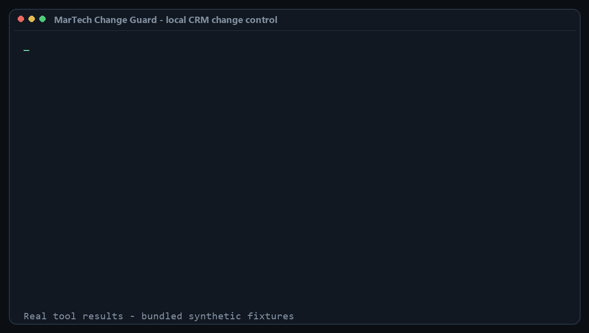
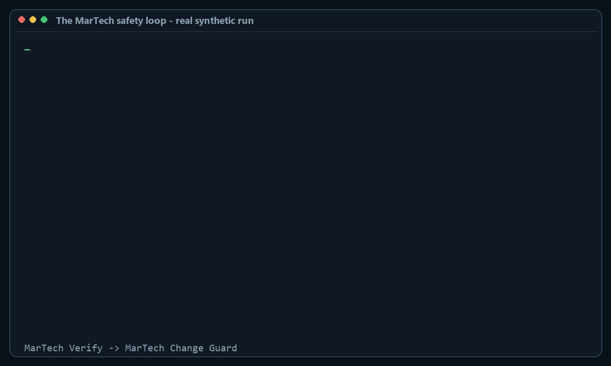

# MarTech Change Guard

**One question: is it safe to make this change?** Preventive, before the fact, one
workflow from plan to receipt.

**Know exactly what a bulk CRM change will do before it runs—and prove what actually changed afterward.**



MarTech Change Guard is a portable skill for Claude Code and Codex. Give it a current CRM
export and a proposed export; it creates a field-level plan, checks your safety policy,
selects a canary, and prepares rollback operations. After your existing CRM or import tool
runs the approved change, give it a fresh export and it checks the complete scope for partial
writes and unexpected side effects.

It is local, deterministic, connector-free, and Python-standard-library only. **It never
connects to or writes to your CRM.**

## The MarTech safety loop

This repository is the preventive half of a connected workflow with
[MarTech Verify](https://github.com/m7mdwb/martech-verify):

1. `$martech-audit` diagnoses a routing, privacy, attribution, or conversion problem from
   read-only exports.
2. `$martech-change-guard` binds that report with `--evidence`, compares current and proposed
   records, and prepares the canary and rollback.
3. A human approves any external CRM/import action.
4. Change Guard verifies a fresh export and issues a receipt.



[Read the complete walkthrough](docs/MARTECH-OPS-LOOP.md) or
[watch the MP4 recording](docs/martech-ops-loop-walkthrough.mp4).

## Start here

You provide three exports over one change lifecycle:

| You provide | When | You get |
|---|---|---|
| Current export + proposed export | Before the change | Exact changeset, `allow` / `review` / `block`, blast radius, canary, and rollback |
| Fresh actual export + saved plan | After execution | Full-scope verification evidence and a SHA-256-linked receipt |

CSV, TSV, semicolon-delimited files, JSON arrays, and JSON Lines are supported, including
UTF-8 BOM and common Windows-1252 spreadsheet exports. Use the same columns and stable record
ID in every export.

Ask your agent:

```text
Use $martech-change-guard to preflight these current and proposed CRM exports. Explain the
decision in plain language and do not perform any live write.
```

## What it catches

- lifecycle stages moving backward;
- protected, immutable, or non-allowlisted fields changing;
- enrichment overwriting values it was only allowed to fill;
- unexpectedly large record or percentage blast radius;
- additions, deletions, duplicate IDs, or mismatched export schemas;
- partial writes and side effects on both changed and supposedly untouched records;
- tampered plan artifacts or a different baseline supplied during verification.

## Install for Claude Code

```bash
claude plugin marketplace add m7mdwb/martech-change-guard
claude plugin install martech-change-guard@martech-guard
```

Then invoke `/martech-change-guard:martech-change-guard` or ask Claude to preflight a CRM
bulk change.

## Install for Codex

Ask Codex:

```text
$skill-installer Install the skill from https://github.com/m7mdwb/martech-change-guard
```

Portable Agent Skills installers can also use:

```bash
npx skills add m7mdwb/martech-change-guard --skill martech-change-guard
```

## Try the synthetic example

```bash
python skills/martech-change-guard/scripts/guard.py plan \
  --before fixtures/current.csv \
  --proposed fixtures/proposed-blocked.csv \
  --key record_id \
  --policy fixtures/policy.json \
  --out guard-plan
```

That exits `2` and explains the planted policy violations. Replace
`proposed-blocked.csv` with `proposed-safe.csv` to create a reviewable plan, execute only
after separate authorization, then verify a fresh export:

```bash
python skills/martech-change-guard/scripts/guard.py verify \
  --before fixtures/current.csv \
  --actual fixtures/actual-safe.csv \
  --key record_id \
  --plan guard-plan \
  --out guard-verification
```

## Decisions and exit codes

| Command | Exit | Meaning |
|---|---:|---|
| `plan` | 0 | Policy checks passed; external authorization is still required |
| `plan` | 1 | Human review and approval required |
| `plan` | 2 | Blocked by an invariant or unsupported record-set change |
| `verify` | 0 | Approved changes verified with no detected side effects |
| `verify` | 1 | Mismatch, missing/unexpected record, or side effect detected |
| either | 3 | Actionable input, policy, plan, or output error |

## Security and privacy

Source exports and generated artifacts can repeat customer values. Keep them local, out of
Git, and under the same access and retention controls as your CRM. Receipts provide tamper
evidence, not identity signatures. See [SECURITY.md](SECURITY.md) before reporting a
vulnerability; never upload production customer data.

## Deliberate boundaries

- No connectors, service, credentials, telemetry, or live writes.
- Updates only in V1; additions and deletions block because rollback semantics vary by CRM.
- Risk scores are deterministic heuristic weights, not calibrated probabilities.
- File verification cannot observe emails, billing events, workflows, or downstream syncs
  unless their results appear in the fresh export.
- Intended for reviewable operational exports, not warehouse-scale streaming.

MarTech Change Guard complements [MarTech Verify](https://github.com/m7mdwb/martech-verify):
Verify audits marketing data for known problems; Change Guard controls a proposed mutation
from plan through post-change evidence.

## Development

```bash
python tests/run_all.py
python tools/make_demo_gif.py --check
python tools/make_connected_demo.py --check
```

See [CHANGELOG.md](CHANGELOG.md), [CONTRIBUTING.md](CONTRIBUTING.md), and the
[v0.3.0 release](https://github.com/m7mdwb/martech-change-guard/releases/tag/v0.3.0).

MIT licensed.
